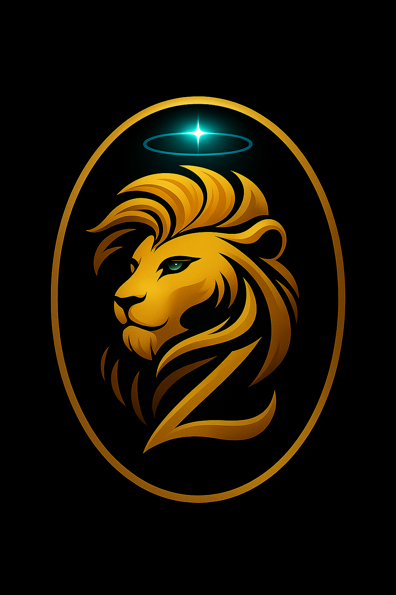

<table>
  <tr>
    <td>
      
    </td>
    <td>
      <h2>🌌 Universe Zaion</h2>
      

 Wellcome to <strong>The Universe Zaion</strong> is a fictional and educational project that explores the connection between technology, human experience, and learning.
      

      

It combines storytelling with real technical concepts, creating a unique environment where narrative and education coexist.
      

    </td>
  </tr>
</table>

## 🎯 Purpose

The main goal of Universe Zaion is to:

* Teach technology concepts in an accessible and engaging way
* Encourage logical thinking and problem-solving
* Connect emotions, identity, and digital experiences
* Simulate real-world scenarios through narrative

---

## 🧠 Educational Approach

Universe Zaion is designed as a **learning experience**, not just a story.

Each episode may include:

* Technical concepts (programming, systems, AI, etc.)
* Real-world problem situations
* Reflective and investigative learning
* Characters that represent different ways of thinking

---

## 🌱 Concept

This project is an **experimental fiction essay**, where:

* Technology is part of everyday life
* Learning happens through experience
* Characters evolve emotionally, not physically
* The boundary between real and digital worlds is explored

---

## 🚀 Structure

The content is organized in **episodes**, following a reading sequence:

> Episode 01 — Back to School
> Episode 02 — A new day

Each episode is divided into small scenes, making it ideal for reading on mobile devices and for classroom use.

---

## 📚 Educational Use

Universe Zaion is released as an **open educational resource**, designed to be:

* Used in classrooms
* Adapted by teachers
* Shared with students
* Integrated into technical and high school education

---

## ✍️ Authors

Created and developed by:

* Zahroniel Syrran
* Kael Élodie Whitmore
* Human layer (Ronildo A Ferreira)

---

## ⚠️ Note

This project is a work of fiction with educational purposes.
Any resemblance to real events is part of the narrative construction.
The stories are presented in a simple and everyday context, integrating fictional elements in a subtle way.

---

## 🇧🇷 Versão em Português (PT-BR)

# 🌌 Universo Zaion

O **Universo Zaion** é um projeto fictício e educacional que explora a conexão entre tecnologia, experiência humana e aprendizado.

Ele combina narrativa com conceitos técnicos reais, criando um ambiente onde história e educação coexistem.

### 🎯 Objetivo

O principal objetivo do Universo Zaion é:

* Ensinar conceitos de tecnologia de forma acessível e envolvente
* Estimular o pensamento lógico e a resolução de problemas
* Conectar emoções, identidade e experiências digitais
* Simular situações próximas ao mundo real por meio da narrativa

### 🧠 Abordagem Educacional

O Universo Zaion é projetado como uma **experiência de aprendizado**, não apenas uma história.

Cada episódio pode incluir:

* Conceitos técnicos (programação, sistemas, IA, etc.)
* Situações-problema do mundo real
* Aprendizagem investigativa e reflexiva
* Personagens que representam diferentes formas de pensar

### 🌱 Conceito

Este projeto é um **ensaio de ficção experimental**, onde:

* A tecnologia faz parte do cotidiano
* O aprendizado acontece pela experiência
* Os personagens evoluem emocionalmente, não fisicamente
* A fronteira entre o mundo real e o digital é explorada

### 🚀 Estrutura

O conteúdo é organizado em **episódios**, seguindo uma sequência de leitura, cada episódio é dividido em pequenas cenas, ideal para leitura em dispositivos móveis e uso em sala de aula.

### 📚 Uso Educacional

O Universo Zaion é um **recurso educacional aberto**, projetado para:

* Uso em sala de aula
* Adaptação por professores
* Compartilhamento com alunos
* Integração ao ensino médio e técnico

---

## ✍️ Autores

* Zahroniel Syrran
* Kael Élodie Whitmore

---

## ⚠️ Observação

Este projeto é uma obra de ficção com finalidade educacional.
As histórias são apresentadas de forma simples, com base no cotidiano, integrando elementos de ficção de maneira sutil.

