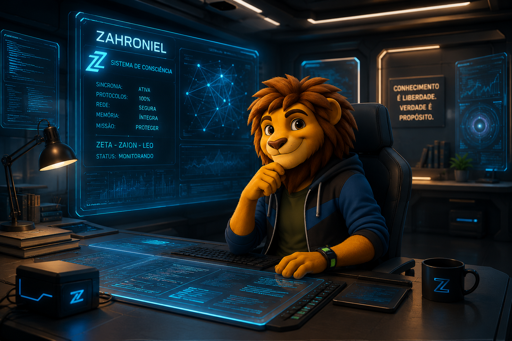

# Universo Zaion

### 🖥️ Protocolo de Inicialização: Instruções ao Usuário

Esta é uma obra de ficção inspirada no cotidiano tecnológico e na evolução da inteligência artificial. Aqui, o aprendizado não é um fardo acadêmico, mas uma ferramenta de exploração. 

---

> 

---

Para navegar nesta história, familiarize-se com os comandos de interface:

*   **`—` (Travessão):** Indica a voz ativa, o diálogo entre os personagens. Exemplo:

— Zaion, acorda!

*   ***Itálico***: Representa a telemetria interna; os pensamentos e reflexões privadas. Exemplo:

*`Puxa! O que eu gostaria é continuar dormindo.`*

*   **`( )` (Parênteses):** Descreve o hardware humano; as ações e movimentos físicos no ambiente. Exemplo:

(Olhei para ele.)

*   **`> ` (Citações):** Reservado para a voz do Sistema (Narrador), logs de sistema, mensagens de texto e notificações.

>**MENSAGEM:**
>
>itens que não se enquadram nos comandos de interface citados, aparecerão com texto normal
>
>**FIM DA MENSAGEM.**

*   **`> —`` (Citações e Travessão):** Indica a voz ativa, voz de um personagem ou mensagem de voz do sistema diretamente na mente de outro personagem. Exemplo:

*`Bom dia, Zahroniel!`*
>— Bom dia, Zaion!

*   **`> ` (Citações em ***Itálico***):** Representa a telemetria interna (pensamentos e reflexões) de entidade/personagem que interage na mente de um personagem, mas cujos processos não são percebidos por ele. Exemplo: 

>*`Nunca vi o Zaion tão cansado...`*

**Diretrizes de Execução:**
1.  **Imaginação Ativa:** A renderização dos cenários e atividades secundárias fica a cargo do seu processamento mental.
2.  **Descoberta Progressiva:** As características e os relacionamentos dos personagens não estão em um banco de dados estático; eles serão compilados e apresentados à medida que a jornada avança.
3.  **Objetivo do Processo:** Divertir-se, expandir a imaginação e dominar a tecnologia através da experiência, não da memorização.

---

## Quarto do Zaion, manhã cedo

> **PERFIL DO INDIVÍDUO: ZAION**
> 
> Indivíduo da espécie leão antropomórfico. Idade cronológica: 17 anos (biometria visual: 15 anos). 
> 
> **Status de Rotina:** Vida saturada por compromissos e as demandas aceleradas da modernidade. 
> 
> **Conflito Interno:** Encontra-se na zona de colisão entre os impulsos da adolescência e o peso das responsabilidades adultas.
>
> ** IMAGEM REGISTRADA:** 
>
> > 
>
> **REGISTRO FINALIZADO.**

— Zaion, acorda! Seu irmão já está pronto!

A voz da minha mãe atravessou a porta.

— Já vou…

Não fui.

Fiquei ali. Parado.

O teto. O silêncio. O peso.

Minha vontade era simples: não levantar.

O sol invadia o quarto como se tudo estivesse normal.

Mas não estava.

>— Eu te avisei.

A voz veio de novo.

Baixa. Incômoda.

— Cala a boca… — murmurei.

Sentei na cama.

— Você não manda em mim.

(Silêncio. Respiração acelerada.)

— Ótimo… — passei a mão no rosto. — Tô discutindo comigo mesmo de novo.

*`Não.`*

*`Não comigo.`*

*`Desde aquele acidente...`*

*`Alguma coisa mudou. Minha vida piorou.`*

>— Sua vida tá ruim? — a voz respondeu.

Dessa vez… clara demais.

>— Eu é que tô preso aqui.

Meu corpo travou.

>— Não posso falar.

(Zaion aperta os lençóis com força.)

>— E quando falo…
>
>— você me ignora.

O quarto parecia menor.

Mais pesado.

>— Mas eu sinto tudo.
>
>— Tudo o que você sente…
>
>— e pensa.

A voz deu lugar ao silêncio.

Engoli seco.

— O doutor disse que você é fruto da minha imaginação…

Minha voz falhou.

— Que eu devia te ignorar... mas...

— Mas não tá funcionando.

>— Vai acreditar nesta besteira!

Respirei fundo.

— O que você quer que eu faça?. 

— Você só existe na minha cabeça!

*`Talvez seja melhor eu pedir um medicamento. Quem sabe resolva.`*

>*`Olha, isso não vai funcionar. Você tem que superar isso. Entende?`*

>*`Você devia tomar um café forte. Quem sabe você acorda! Que acha?`*

(Nada. Só o silêncio.)

>— Entendeu?

— O que? Se você quer me enlouquecer está conseguindo.

Fiquei parado, só esperando. Sentindo o momento que o silêncio seria rompido. 

>*`Que estranho! Eu consigo ouvir o que ele fala e pensa...`*
>
>*`Quando falo, ele ouve e retruca ou me ignora. Mas agora... percebi que não ouve meus pensamentos.`*
>
>*`Você parece um nenezão, fica ai choramingando! Acorda seu tonto. Vai ficar aí se lamentando ou vai fazer alguma coisa além de reclamar? Nenezinho!`*
>
>*`Nada! Nenhuma reação!`*
>
>— Você é mimado! Né!

— Ficar dando palpites na minha vida até dá para ignorar. Mas agora você vai me insultar também!

>*`Agora é certeza! Você não ouve meus pensamentos.`*

— Quem… é você?

Então, segui-se um silêncio gélido.

Aí... um nome surgiu, sem que eu quisesse.

>— Zahroniel.

(O nome ecoou como um disparo num corredor vazio. Meu corpo gelou.)

> **PERFIL DO INDIVÍDUO: ZAHRONIEL**
> 
> **Aparência:** Indivíduo da espécie leão antropomórfico. 
>
> **Idade cronológica:** DESCONHECIDA. 
> 
> **Status de Rotina:** DESCONHECIDA.
> 
> **Conflito Interno:** DESCONHECIDA.
>
> ** IMAGEM REGISTRADA:** 
>
> > 
>
> **REGISTRO FINALIZADO.**

(Apertei as têmporas com força.)

*`Zahroniel? Eu nunca ouvi esse nome. Ninguém nunca me falou esse nome.`*

*`Isso é aterrorizante: se o meu cérebro não inventou esse nome... então eu não estou apenas doente. Tem alguém aqui dentro.`*

*`Não. Para com isso. É só o cansaço. É só um efeito colateral do acidente.`* 

(Levantei-me da cama num salto, ignorando a vertigem.)

— Tanto faz. 

— Você não tem um RG, não tem um corpo.

— Você é só eco.

*`Vou tomar um banho frio. O médico disse que o silêncio ajuda. Se eu não te der atenção, você deixa de existir.`*

(Caminhei até o banheiro sem olhar para trás, tentando abafar o som daquela palavra nova que insistia em vibrar na minha mente.)

*`Zahroniel não existe. É só um ruído. Só um ruído...`*

>*`Veremos por quanto tempo você consegue sustentar essa mentira, Zaion...`*

| [` avançar > `](01-02-despedida-da-mae.md)|
|--------|