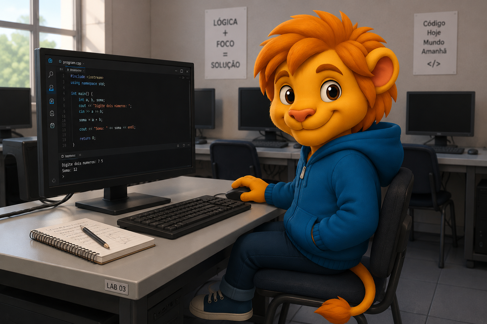

## Cozinha da casa, despedida da mãe

— Bom dia, Zaion! Lembra que hoje eu e sua tia embarcamos para a Itália à tarde.

(Ela falava enquanto organizava algumas coisas na bolsa.)

— Você vai ficar responsável pelo Léo e o Darian, tá bem?

*`Ryo. Quase ninguém chamava ele de Darian.`*

— Ah, mãe, fala sério… — Léo cruzou os braços. — Eu não preciso de babá!

> **PERFIL DO INDIVÍDUO: LEO**
>
> Indivíduo da espécie leão antropomórfico. Idade cronológica: 13 anos (biometria visual: 12 anos).
>
> **Status de Rotina:** Estudante do ensino fundamental.
>
> **Conflito Interno:** Ainda enxerga o mundo com simplicidade infantil e vê o irmão como referência. Percebe, aos poucos, que Zaion está mudando — e sente que ele está se afastando.
>
> ** IMAGEM REGISTRADA:** 
>
> > 
>
> **REGISTRO FINALIZADO.**

— O Zaion é muito mandão!

— Léo — a voz dela mudou — sem discussões.

Ela olhou para ele com uma autoridade que até me surpreendeu.

— Obedeça seu irmão.

Aqueles segundos de silêncio, parecia uma eternidade.

— A van já tá chegando.

(Ela pega uma pasta sobre a mesa e folheia rapidamente os documentos.)

— Só mais uma coisa…

— O advogado vai levar isso… — olhou pra mim — e os papéis da sua tia.

— Pra eu assinar?

— Lá na escola.

(Assenti.)

— Tá certo, mãe. Boa viagem.

*`Falei baixo. Calmo demais… até pra mim.`*

(Quando percebi, o Léo já estava abraçado nela. Forte. Silencioso.)

*`Só falta ele começar a chorar.`*

*`Ah, para… ela só vai viajar.`*

De repente, me senti como se fosse o único no mundo.

*`Por um instante… tudo pareceu diferente. Errado. Como se alguma coisa estivesse prestes a acontecer. E eu ainda não soubesse o quê.`*

|[` < voltar `](01-01-quarto-do-zaion-manha-cedo.md)| [` avançar > `](01-03-entrada-da-escola.md)|
|--------|-----|

