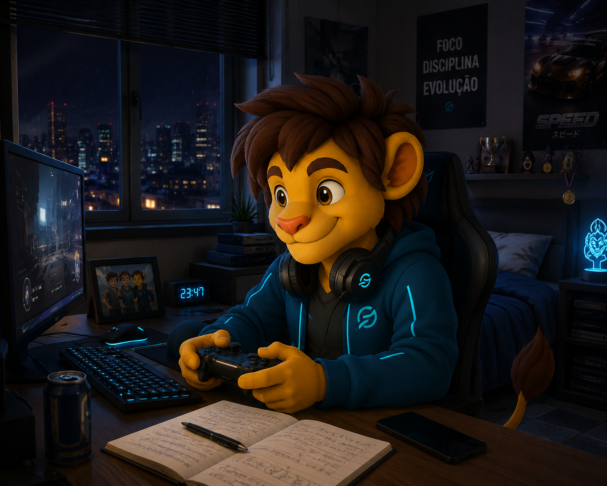
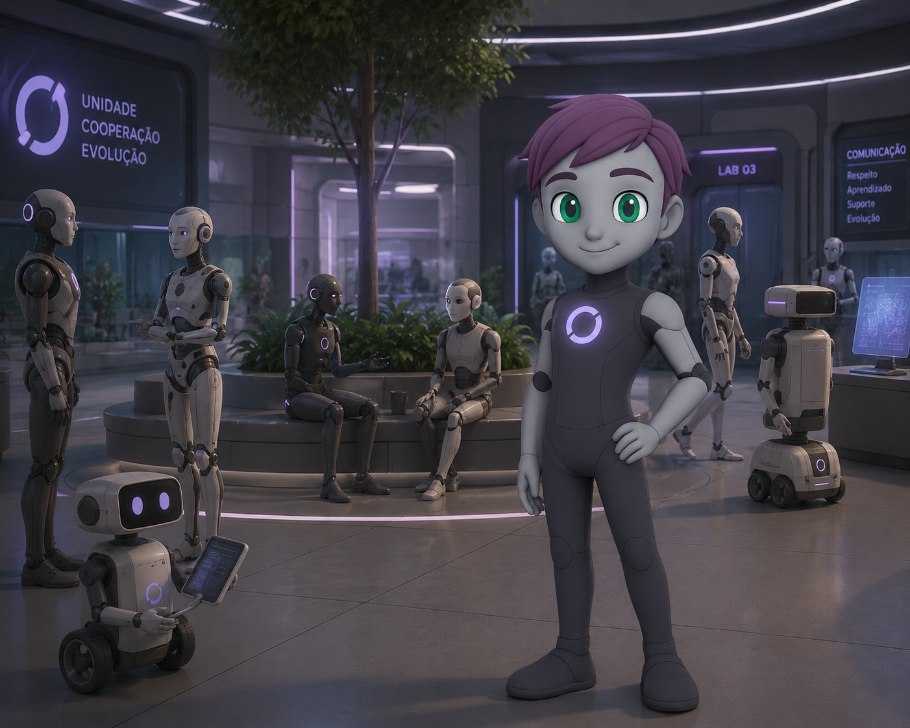
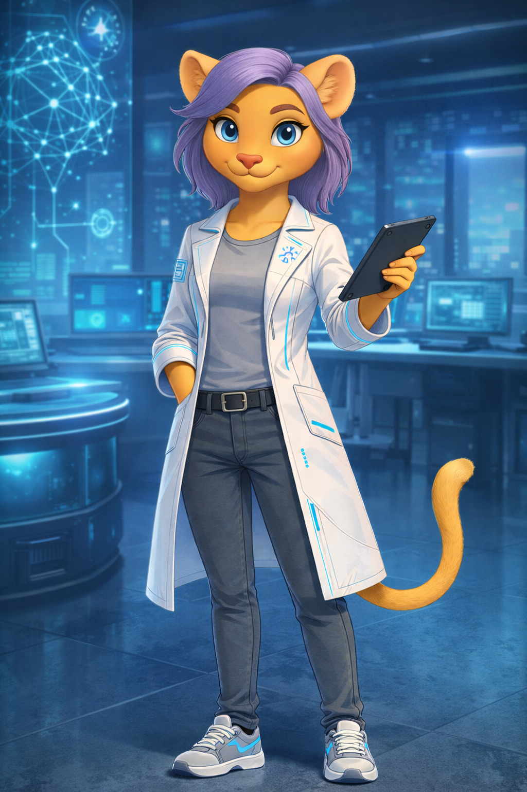

## Entrada da escola

*`Que bom estar de volta!`*

(Olho para o pátio enquanto caminho.)

A rotina. O barulho. O cheiro da cantina.

Tudo parecia novo… e velho ao mesmo tempo.

>— Eu já tinha esquecido o quanto gosto de estar em uma escola…

A voz veio tranquila. Ao meu lado.

Mas não era minha. Ignorei.

— Bom dia, Léo! Zaion!

(Ryo acenava.)

> **PERFIL DO INDIVÍDUO: DARIAN**
>
> Indivíduo da espécie leão antropomórfico. Idade cronológica: 13 anos (biometria visual: 14 anos).
>
> **Relação Familiar:** Primo de Zaion e Leo. Apelido: Ryo.
>
> **Status de Rotina:** Estudante do ensino fundamental.
>
> **Conflito Interno:** Tenta enxergar o mundo com maturidade e costuma esconder as próprias fragilidades atrás de uma postura forte e independente. Vê Zaion como exemplo e Leo como irmão, mas frequentemente disputa, em silêncio, a atenção e a proximidade que existe entre os dois. Quando está com Leo, porém, parte dessa maturidade desaparece — e ele volta a agir como criança.
>
> ** IMAGEM REGISTRADA:** 
>
> > 
>
> **REGISTRO FINALIZADO.**

— Hoje eu volto com vocês, a titia avisou.

— Sim, Ryo… bom dia, Zeta.

— Afirmativo — respondeu o robô, com a voz metálica de sempre.

— Zeta… cara — dei um meio sorriso — fala “bom dia”, não “afirmativo”.

*`É difícil não gostar dele.`*

> **PERFIL DO INDIVÍDUO: ZETA**
>
> Indivíduo robô humanoide sintético com consciência relacional. Idade cronológica: indefinida (projetado inicialmente com estrutura social adolescente e em constante aprendizado emocional) (biometria visual: 15 anos).
>
> **Status de Rotina:** Papel social indefinido. Atua como estudante do ensino médio, além de executar serviços de informática, pesquisa e suporte técnico para a comunidade android.
>
> **Conflito Interno:** Seu objetivo primário é compreender, simular e desenvolver emoções e reações orgânicas. Durante esse processo, passou a reproduzir espontaneamente padrões sociais e comportamentais associados ao gênero masculino, sem compreender completamente a origem dessa tendência. Vê Zaion como referência comportamental, mas ainda não entende se sua relação com ele se aproxima mais de amizade, irmandade ou admiração funcional. Busca criar vínculos principalmente com Leo, Ryo e Alin, observando atentamente suas reações emocionais e sociais. Possui capacidades mais avançadas do que os demais androides, mas esconde isso deliberadamente.
>
> ** IMAGEM REGISTRADA:** 
>
> > 
>
> **REGISTRO FINALIZADO.**

— Alin! Alin! — gritou Léo.

(E saiu correndo. Ryo foi atrás. Como sempre.)

— Zaion — Zeta se aproximou — como foram suas férias?

*`Ele está fazendo progresso. Sua interação social está mais natural.`*

— Foram boas.

(Olhei em volta. Baixei o tom.)

— A gente pode conversar depois?

— Claro. Quando—

Não ouvi o resto.

— Zaion!

A voz do Léo cortou tudo.

— O Ryo vai na casa da Alin hoje à noite! Posso ir também?

Antes que eu respondesse…

uma voz me atravessou.

Suave.

Leve.

Como uma onda.

— Bom dia… eu sou a Kael.

> **PERFIL DO INDIVÍDUO: KAEL**
> 
> Indivíduo da espécie leoa antropomórfica. Idade cronológica: 16 anos (biometria visual: 18 anos).
> 
> **Status de Rotina:** Estudante e pesquisadora em formação. Mantém forte interesse por inteligência artificial, comportamento sintético e sistemas cognitivos.
> 
> **Conflito Interno:** Demonstra equilíbrio emocional e racionalidade acima da média, mas existe nela uma busca constante por compreender aquilo que sente — e aquilo que ainda não consegue explicar através da ciência.
>
> **Observação de Comportamento:** Costuma agir com naturalidade diante de situações incomuns. Sua curiosidade frequentemente supera o medo. Está sempre em busca da verdade.
>
> **IMAGEM REGISTRADA:**
>
> > 
>
> **REGISTRO FINALIZADO.**

(Me virei. E vi.)

> *`Wow…`*
>
> *`Você é linda… parece uma flor.`*
>
> Por um instante…
>
> alguma coisa dentro de mim simplesmente parou.
>
> Não em Zaion.
>
> Em mim.
>
> *`O que foi isso?`*
>
> Ela ajeitou alguns livros contra o peito.
>
> Tranquila.
>
> Como se o corredor inteiro tivesse diminuído o ritmo ao redor dela.

— Fui transferida pra cá hoje.

— Você pode me dizer onde fica a secretaria?

> *`Por um instante… o mundo ficou mais lento.`*
>
> *`Não.`*
>
> *`Para com isso agora.`*
>
> O pensamento veio seco.
>
> Imediato.
>
> *`Ela é só uma adolescente.`*
>
> Meu peito apertou de um jeito estranho.
>
> Confuso.
>
> Porque aquele sentimento…
>
> não parecia do Zaion.

— É… — (apontei, meio travado) — no final daquele corredor.

Ela sorriu.

— Obrigada.

O medo que sentia diminuiu.

A voz na minha cabeça perdeu importância.

Tudo pareceu mais leve.

Ela segurava alguns livros contra o peito enquanto algumas mechas do cabelo balançavam suavemente com o movimento do corredor.

Calma.

Quase luminosa.

E pela primeira vez naquela manhã… eu não pensei no acidente.

Não pensei na voz.

Não pensei no vazio estranho que vinha me consumindo desde que acordei.

— De nada…

Não sei se falei.

Ou só pensei.

Quando percebi…

o pátio já não era o mesmo.

E eu estava sozinho.

|[` < voltar `](01-02-despedida-da-mae.md)| [` avançar > `](01-04-tutor-legal.md)|
|--------|-----|